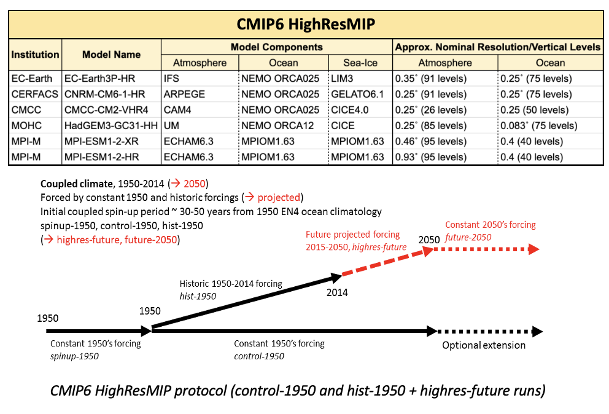

# VIZ3D-ENSO (BETA Version)

## Overview

VIZ3D-ENSO is a 3-D visualization dashboard for ENSO (El Niño-Southern Oscillation) composites from coupled and ocean-only model simulations. This dashboard allows users to explore ENSO event types, time periods, and composite data interactively.

## Model & observation-based data used

Models considered are as follows:

1. **<ins>Coupled Model(s)</ins>**: ENSO composites made from CMIP6 HighResMIP models were considered for this study. The table below summarizes the models used and the image shows the HighResMIP protocol schematic.


Both control-1950 (hereby referred to as 'control') and hist-1950 + highres-future (hereby referred to as 'historical') have been considered for making these SST anomaly composites.

2. **<ins>Forced Ocean-Only Model(s)</ins>**: ‘Near Present Day’ NEMO eORCA025 (75 vertical levels and 0.25˚ horizontal res.) forced ocean-only configuration, run and maintained by the MSM group.Simulations with ERA5 and JRA55 atmos. forcings considered (hereby referred to as): NPD_eORCA025_ERA5, NPD_eORCA025_JRA55.

3. **<ins>Observation-based data</ins>**: Model data was compared with MOHC’s EN4 (observation-based) and ECMWF ORAS5 reanalysis temperature data.

SST anomalies have been calculated based on centred 30-year shifting reference periods that shift every five years. Both surface and subsurface temperature anomaly analyses were undertaken. ENSO events have been identified based on the Oceanic Nino Index (ONI) definition.

## Installation

To install the required packages, run:
```bash
pip install numpy tqdm xarray dash
```

## Usage

To run the dashboard, execute:
```bash
python3 app.py
```
Then open the provided link in your browser.

## Features

- **Event Types**: EL_NINO, LA_NINA
- **Time Periods**: 1976-2023, 1950-2023, 1950-2050
- **Composites**: Observations + NPD Runs + CMIP6 HighResMIP Runs

For dashboard responsiveness, composites are interpolated to 1˚x1˚ horizontal resolution and evenly spaced 10m depth levels.

## Notes

- `scratch.ipynb` is used for testing new features and can be ignored.

## License

This project is licensed under the MIT License. See the [LICENSE](LICENSE) file for details.

---
Feel free to reach out at sg13n23@soton.ac.uk if you have any questions or need further assistance!